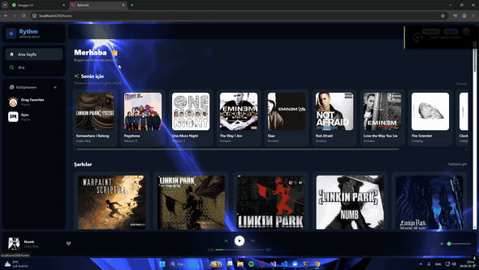
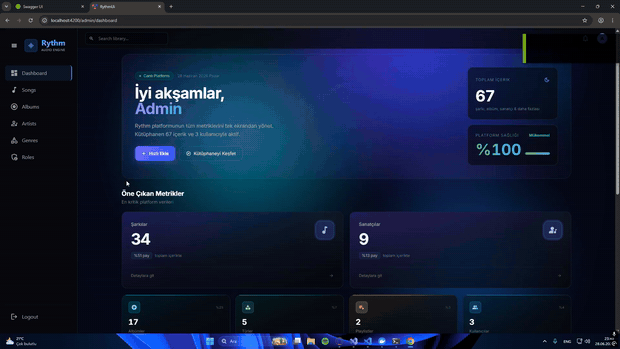

# 🎵 Rythm

> A modern music streaming platform built with **ASP.NET Core (.NET 8)** and **Angular 21**, following **Clean Architecture** and **CQRS** principles.

<p align="center">
  <video src="docs/home.mp4" width="800" autoplay loop muted playsinline></video>
  
</p>

---

# ✨ Features

## 👤 User Features

- 🎵 Stream music with HTML5 Audio Player
- 🔍 Fast fuzzy search powered by Elasticsearch
- ❤️ Like and unlike songs
- 📂 Create and manage playlists
- 👤 Update user profile
- 🎯 Personalized song recommendations using ML.NET
- 🔒 Free / Premium song access control
- 🎨 WebGL (GLSL) animated background UI

---

## 🛠 Admin Features

- 🎵 Song Management (CRUD)
- 🎤 Artist Management
- 💿 Album Management
- 🏷 Genre Management
- 👥 User & Role Management
- 📊 Dashboard Statistics
- 📤 Upload audio (MP3, WAV, FLAC) and cover images (JPG, PNG, WEBP)

---

## ⚙ Technical Features

- 🔐 JWT Authentication
- 🛡 Role-Based Authorization
- ⚡ Redis Caching
- 🔍 Elasticsearch Integration
- 🤖 ML.NET Recommendation System
- 📁 Local File Storage
- 🧩 Global Exception Middleware
- 📖 Swagger Documentation (Development)

---

# 🚀 Tech Stack

<table>
<tr>
<td valign="top" width="52%">

<h3 align="left">⚙️ Backend</h3>

<table>
<tr>
<th>Technology</th>
<th>Purpose</th>
</tr>
<tr>
<td>.NET 8</td>
<td>Web API</td>
</tr>
<tr>
<td>ASP.NET Core Identity</td>
<td>User &amp; Role Management</td>
</tr>
<tr>
<td>Clean Architecture</td>
<td>Layered Architecture</td>
</tr>
<tr>
<td>CQRS + MediatR</td>
<td>Command / Query Separation</td>
</tr>
<tr>
<td>Entity Framework Core 8</td>
<td>ORM</td>
</tr>
<tr>
<td>SQL Server</td>
<td>Database</td>
</tr>
<tr>
<td>Redis</td>
<td>Caching</td>
</tr>
<tr>
<td>Elasticsearch</td>
<td>Search Engine</td>
</tr>
<tr>
<td>ML.NET</td>
<td>Recommendation System</td>
</tr>
<tr>
<td>JWT</td>
<td>Authentication</td>
</tr>
<tr>
<td>AutoMapper</td>
<td>Object Mapping</td>
</tr>
<tr>
<td>Swagger</td>
<td>API Documentation</td>
</tr>
</table>

</td>
<td width="4%"></td>
<td valign="top" width="44%">

<h3 align="left">🎨 Frontend</h3>

<table>
<tr>
<th>Technology</th>
<th>Purpose</th>
</tr>
<tr>
<td>Angular 21</td>
<td>SPA Framework</td>
</tr>
<tr>
<td>TypeScript</td>
<td>Programming Language</td>
</tr>
<tr>
<td>Tailwind CSS</td>
<td>UI Design</td>
</tr>
<tr>
<td>WebGL (GLSL)</td>
<td>Animated Background</td>
</tr>
<tr>
<td>jwt-decode</td>
<td>JWT Parsing</td>
</tr>
</table>

</td>
</tr>
</table>

---

# 🏛 Architecture

```text
                ┌──────────────────────┐
                │      Rythm.API       │
                └──────────┬───────────┘
                           │
          ┌────────────────┴────────────────┐
          │                                 │
 ┌────────▼────────┐               ┌────────▼────────┐
 │  Persistence    │               │ Infrastructure  │
 │ EF Core         │               │ Redis           │
 │ Repositories    │               │ Elasticsearch   │
 │ Migrations      │               │ JWT             │
 └────────┬────────┘               │ ML.NET          │
          │                        └────────┬────────┘
          └────────────────┬────────────────┘
                           │
                   ┌────────▼────────┐
                   │   Application   │
                   │ CQRS + MediatR  │
                   │ DTOs            │
                   │ Interfaces      │
                   └────────┬────────┘
                            │
                    ┌───────▼────────┐
                    │     Domain      │
                    │    Entities     │
                    └─────────────────┘
```

---

# 📂 Project Structure

```text
Rythm/
│
├── Rythm.sln
├── Rythm.API/
├── Rythm.Application/
├── Rythm.Domain/
├── Rythm.Persistence/
├── Rythm.Infrastructure/
└── rythm-ui/          # Angular application
```

---

# 🔄 Request Flow (CQRS)

```text
HTTP Request
      │
      ▼
Controller
      │
      ▼
MediatR
      │
      ▼
Command / Query Handler
      │
      ▼
Repository / Service
      │
      ▼
Database / Redis / Elasticsearch
```

---

# 🤖 Recommendation System

The recommendation system uses **ML.NET Matrix Factorization** to generate personalized recommendations based on users' listening history.

```text
User listens to a song
          │
          ▼
Listening History (POST /api/Histories)
          │
          ▼
ML.NET Model
(auto-trained if missing, minimum 10 records)
          │
          ▼
Top 10 Recommendations
          │
          ▼
SQL Fallback (Most Played Artists)
```

---

# 📸 Screenshots

## 🏠 Home

<p align="center">
  
</p>

---

## 🔍 Search

<p align="center">
  
</p>

---

## 🎤 Artist

<p align="center">
  
</p>

---

## 📂 Playlist

<p align="center">
  
</p>

---

## 👑 Admin Dashboard

<p align="center">
  
</p>

---

# 👨‍💻 About

**Rythm** is a full-stack music streaming application developed as a portfolio project.

The project showcases modern backend and frontend development practices by combining **Clean Architecture**, **CQRS with MediatR**, **JWT Authentication**, **Redis Caching**, **Elasticsearch**, and an **ML.NET-powered recommendation engine** with a responsive **Angular 21** user interface enhanced by **WebGL animations**.

⭐ If you find this project interesting, consider giving it a star on GitHub.

